# 装备道具 (Equipment)

PEAK游戏中的装备道具详细信息。装备道具可以帮助童子军在攀登过程中获得优势，大多数装备可以从行李箱中找到，有些可以在坠机地点或生物群系顶部找到。

## 消耗品 (Consumable)

###  解毒剂 (Antidote)
- **ID**: 2
- **重量**: 2.5
- **效果**:
  - 中毒 -35
  - 热量 -10
  - 孢子 -35
- **特点**: 扔出可砸开，烹饪后会爆炸
- **获取**: 行李箱

###  气球 (Balloon)
- **重量**: -5
- **效果**:
  - 每个气球降低重力18%，持续2分钟或100米
  - 同时使用6个气球可以实现有限飞行
  - 可与自身和一束气球叠加
  - 被动移除重量 -5（持有、背包中或放在背包里时）
- **获取**: 行李箱
- **成就**: 气球奖章

###  一束气球 (Balloon Bunch)
- **重量**: -15
- **效果**:
  - 每束降低重力54%，持续2分钟或100米
  - 同时使用2束可以实现有限飞行
  - 可与自身和气球叠加
  - 被动移除重量 -15
- **获取**: 行李箱

### 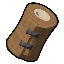 绷带 (Bandages)
- **ID**: 7
- **重量**: 2.5
- **效果**: 受伤 -30
- **使用时间**: 4秒
- **特点**: 可烹饪
- **获取**: 行李箱、医疗点
- **成就**: 复活3名童子军获得救星奖章

###  吹箭筒 (Blowgun)
- **重量**: 2.5
- **效果**:
  - 发射单支飞镖，命中童子军后:
    - 清除除诅咒外的所有状态效果
    - 造成昏睡 +120
- **限制**: 单人游戏中不会生成
- **获取**: 行李箱

###  急救箱 (First Aid Kit)
- **重量**: 5
- **效果**:
  - 中毒 -100
  - 孢子 -100
  - 受伤 -100
- **使用时间**: 5秒
- **获取**: 行李箱
- **成就**: 急救奖章

###  照明棒 (Flare)
- **ID**: 39
- **重量**: 0
- **效果**:
  - 点燃后显示与童子军颜色匹配的彩色烟雾柱
  - 在顶峰使用时召唤救援直升机
- **重要性**: ⭐⭐⭐⭐⭐（游戏胜利必需道具）
- **获取**: 探险途中、行李箱
- **注意**: 顶峰没有照明棒

###  暖宝宝 (Heat Pack)
- **重量**: 0
- **效果**: 在60秒内移除寒冷 -360
- **获取**: 行李箱
- **适用环境**: 雪山、顶峰

###  灵药菇 (Remedy Fungus)
- **重量**: 2.5
- **效果**: 丢下时产生烟雾云，随时间为云内童子军移除受伤 -45和中毒 -30
- **获取**: 行李箱

### 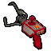 救援抓钩 (Rescue Claw)
- **重量**: 2.5
- **效果**:
  - 将童子军拉向地形，或将其他童子军拉向使用者
  - 朝上瞄准时范围30米，朝下瞄准时范围40米
- **成就**: 灾害响应奖章 - 使用救援抓钩将昏迷朋友拖行30米
- **获取**: 行李箱

###  卷轴 (Scroll)
- **重量**: 0
- **效果**: 打开后显示撕页
- **获取**: 行李箱、特殊地点

### 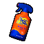 防晒喷雾 (Sunscreen)
- **重量**: 2.5
- **使用次数**: 3次
- **效果**: 喷出防晒云，提供90秒临时防晒保护，进入云中的任何玩家都能获得保护
- **获取**: 行李箱
- **适用环境**: 方山

## 可放置道具 (Placeable)

###  弹力菇 (Bounce Fungus)
- **重量**: 2.5
- **效果**:
  - 创建与投掷地形对齐的弹跳平台
  - 每次弹跳恢复部分体力
- **成就**: 菌类杂技奖章 - 从蘑菇上弹起40米高
- **获取**: 行李箱

### 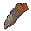 锁链发射器 (Chain Launcher)
- **重量**: 2.5
- **效果**:
  - 在两点之间创建可攀爬的锁链
  - 锁链从使用者发射位置开始
  - 不能向上发射锁链
- **获取**: 行李箱

###  检查点旗标 (Checkpoint Flag)
- **重量**: 2.5
- **效果**: 为放置者创建一次性重生检查点，保存和恢复放置时的所有状态
- **获取**: 行李箱

###  云雾菇 (Cloud Fungus)
- **重量**: 2.5
- **效果**:
  - 投掷到墙上时创建平台
  - 在空中投掷顶点创建平台
- **获取**: 行李箱

###  魔豆 (Magic Bean)
- **重量**: 2.5
- **效果**: 丢下或投掷后3秒开始生长藤蔓，无阻碍时可长到10米高
- **获取**: 行李箱

###  岩钉 (Piton)
- **ID**: 99
- **重量**: 2.5
- **效果**:
  - 附着在可攀爬表面，提供抓握和休息点以恢复体力
  - 限制：一次1名童子军
  - 悬挂在岩钉上时可以使用主背包中的物品
- **获取**: 行李箱
- **成就**: 攀岩奖章 - 放置10根岩钉
- **注意**: 使用岩钉会影响环保奖章

###  便携火炉 (Portable Stove)
- **重量**: 5
- **效果**:
  - 用于烹饪道具
  - 每秒为2米内的童子军移除寒冷 -5
  - 放置后持续60秒
- **获取**: 行李箱

### 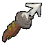 绳索炮 (Rope Cannon)
- **重量**: 2.5
- **效果**: 发射鱼叉，接触兼容表面时释放7.5米绳索
- **获取**: 行李箱

###  绳索 (Rope Spool)
- **重量**: 2.5
- **效果**:
  - 创建可攀爬绳索（最长10米），可附着在任何可攀爬表面
  - 绳索受重力影响
  - 每卷包含12.5米绳索
- **获取**: 行李箱
- **成就**: 急救奖章 - 单次探险放置100米绳索

### 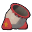 童子军大炮 (Scout Cannon)
- **重量**: 15
- **效果**:
  - 可垂直瞄准
  - 使用时放置无限使用的大炮，锁定在调整的角度和位置
  - 点燃导火线后短暂延迟，大炮内的物体或童子军被发射出去
- **成就**: 进入童军大炮并将自己射过方山
- **获取**: 行李箱

###  踏板菇 (Shelf Fungus)
- **重量**: 2.5
- **效果**: 投掷到墙上时创建平台
- **获取**: 行李箱

## 可使用道具 (Usable)

### 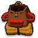 背包 (Backpack)
- **ID**: 6
- **重量**: 0
- **效果**: 可携带4个额外道具
- **获取**: 坠机地点、营火处
- **提示**: 背上背包是携带更多物品的绝佳选择，但要注意携带重量会减少攀爬体力

###  宾邦 (Bing Bong)
- **重量**: 5
- **效果**: 
  - 可向宾邦提问"是或否"问题
  - 用于与主播对话（该功能已于6月从游戏中删除）
- **成就**: 宾邦奖章 - 帮助宾邦逃离岛屿
- **获取**: 行李箱

###  望远镜 (Binoculars)
- **重量**: 0
- **效果**: 可以看得更远
- **成就**: 天文学奖章
- **获取**: 行李箱

###  喇叭 (Bugle)
- **重量**: 0
- **效果**: 使用时演奏音符
- **成就**: 动物小夜曲奖章 - 为水豚演奏喇叭
- **获取**: 行李箱

###  罗盘 (Compass)
- **重量**: 0
- **效果**: 指向顶峰
- **获取**: 行李箱

###  飞盘 (Flying Disc)
- **重量**: 0
- **效果**: 可以投掷给其他童子军进行撞击
- **成就**: 极限奖章 - 从100米外接住飞盘
- **获取**: 行李箱

###  旅行指南 (Guidebook)
- **重量**: 0
- **效果**: 教玩家如何玩游戏
- **获取**: 坠机地点
- **作者**: 童军领队迈尔斯

### 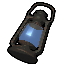 提灯 (Lantern)
- **重量**: 5
- **效果**:
  - 在60秒内为附近玩家移除寒冷 -150
  - 可以熄灭以保留剩余燃料
  - 放在背包中时保持点燃状态
- **获取**: 行李箱

###  太阳伞 (Parasol)
- **重量**: 2.5
- **效果**:
  - 保护玩家免受方山强烈阳光照射
  - 在空中时减缓玩家下降速度
- **获取**: 行李箱
- **适用环境**: 方山

###  海盗罗盘 (Pirate's Compass)
- **重量**: 0
- **效果**: 指向最近的未开启行李箱
- **获取**: 行李箱

###  火炬 (Torch)
- **重量**: 0
- **效果**: 提供临时光源
- **获取**: 仅在古墓中
- **限制**: 古墓专属道具

## 神秘道具 (Mystical Items)

神秘道具只能通过古老行李箱、古老雕像或秘密地点获得。获得神秘道具即可获得玄学奖章。

###  古老玩偶 (Ancient Idol)
- **重量**: 40
- **效果**:
  - 主动持有时完全免疫任何伤害或负面状态效果
  - 仍会受到炸药等伤害来源的击退，可能导致摔下山失去进度
  - 主动持有时阻止额外体力消耗
- **获取**: 仅在古墓中
- **成就**: 24K奖章 - 将其投入熔窑的熔岩中

### 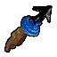 反重绳索炮 (Anti-Rope Cannon)
- **重量**: 0
- **效果**:
  - 发射鱼叉，接触兼容表面时释放一段反重力绳索
  - 警告：丢弃的反重绳索炮会飘走！
- **获取**: 古老行李箱、秘密地点

###  反重绳索 (Anti-Rope Spool)
- **ID**: 1
- **重量**: -2.5
- **效果**:
  - 创建可攀爬反重绳索（最长10米），可附着在任何可攀爬表面
  - 反重绳索会反抗重力向上漂浮
  - 每卷包含12.5米反重绳索
  - 警告：丢弃的反重绳索会向上漂浮！
  - 烹饪后会破碎
- **获取**: 古老行李箱、秘密地点

###  友谊喇叭 (Bugle of Friendship)
- **重量**: 2.5
- **效果**:
  - 使用时演奏音符
  - 演奏时在大范围内为童子军提供无限体力，总计最多7.5秒
- **成就**: 动物小夜曲奖章
- **限制**: 单人游戏中不会生成
- **获取**: 古老行李箱

### 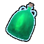 万灵药 (Cure-All)
- **重量**: 2.5
- **使用次数**: 3次
- **效果**: 移除饥饿 -20、中毒 -35、孢子 -35、受伤 -35、昏睡 -35、寒冷 -35、热量 -35、尖刺 -25、诅咒 -5
- **特点**:
  - 烹饪会导致物品爆炸但立即给玩家一次使用
  - 丢下万灵药会使其破碎
- **获取**: 古老行李箱

###  诅咒骷髅 (Cursed Skull)
- **重量**: 5
- **效果**:
  - 使用会立即杀死持有者
  - 为其他童子军提供额外体力 +50并清除除诅咒外的所有负面状态效果
- **获取**: 仅在古老行李箱中
- **限制**: 单人游戏中不会生成

###  仙子提灯 (Faerie Lantern)
- **重量**: 5
- **效果**:
  - 在30秒内为附近玩家移除热量 -75、寒冷 -150、中毒 -75、孢子 -75、昏睡 -150、受伤 -75
  - 可以熄灭以保留剩余燃料
  - 放在背包中时保持点燃状态
- **获取**: 古老行李箱

###  潘多拉餐盒 (Pandora's Lunchbox)
- **重量**: 2.5
- **使用次数**: 3次
- **效果**: 清除所有状态，然后随机化饥饿、额外体力、受伤、中毒、孢子、寒冷、热量和昏睡
- **特点**: 烹饪会导致餐盒爆炸但立即对玩家造成一次使用效果
- **获取**: 古老行李箱

### 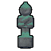 童子军雕像 (Scout Effigy)
- **重量**: 5
- **效果**: 用于在目标位置复活死亡的童子军
- **限制**: 单人游戏中不会生成
- **获取**: 古老行李箱

###  童军领队的喇叭 (Scoutmaster's Bugle)
- **重量**: 2.5
- **效果**:
  - 使用者和附近童子军获得额外体力 +100
  - 召唤童军领队持续两分钟并将使用者标记为目标
- **稀有度**: 比其他神秘道具更稀有
- **获取**: 古老行李箱

### 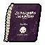 骨之书 (The Book of Bones)
- **重量**: 2.5
- **效果**:
  - 自我使用后变成活骷髅
  - 对其他玩家的骷髅使用会使其复活为活骷髅
  - 变成骷髅时造成诅咒 +25
  - 活骷髅除受伤和诅咒外免疫所有痛苦
  - 受伤大幅增加，如果超过最大体力会立即杀死玩家
  - 已经是骷髅时使用会变回普通童子军，移除诅咒 -25
  - 烹饪会恢复诅咒 -25而不是造成伤害
- **获取**: 古老行李箱

###  曲迁罗盘 (Warp Compass)
- **重量**: 0
- **效果**: 具体效果未知（神秘道具）
- **获取**: 古老行李箱

## 装备使用策略

### 攀爬装备使用建议

#### 岩钉策略
- 在困难路段使用节省体力
- 创建安全路径供团队使用
- 注意：放置道具会影响环保奖章
- 建议携带：新手3-5根，进阶5-10根

#### 绳索使用
- **绳索**: 受重力影响，适合下降或横向移动
- **反重绳索**: 向上漂浮，适合垂直攀爬
- 警告：不要丢弃反重绳索，会飘走
- 不要烹饪反重绳索，会破碎

#### 锁链发射器
- 在间隙处创建桥梁
- 不能向上发射
- 适合横向或下降移动

### 医疗道具使用建议

#### 绷带使用
- 受伤时立即使用（减少体力损失）
- 可以烹饪增强效果
- 建议携带：新手2个，进阶2-3个

#### 解毒剂使用
- 食用有毒浆果（绿脆莓、青荔莓等）后使用
- 不要烹饪（会爆炸）
- 可以扔出砸开
- 为毒理学奖章做准备（恢复总计200点中毒）

#### 急救箱
- 多种效果合一的强力医疗道具
- 使用时间较长（5秒），在安全地点使用
- 稀有度较高，优先保存用于紧急情况

### 功能道具使用建议

#### 背包
- 零重量，可以放心携带
- 用于整理物品和团队物资共享
- 在营火处和坠机地点都能找到

#### 照明棒
- 游戏胜利必需道具
- 优先保护，不要丢失
- 顶峰没有照明棒，必须从下方携带

#### 罗盘系列
- **罗盘**: 指向顶峰，避免迷路
- **海盗罗盘**: 寻找行李箱，获取更多装备
- **曲迁罗盘**: 神秘效果

### 神秘道具使用建议

#### 万灵药
- 强大的多效果恢复道具
- 小心使用，不要丢下（会破碎）
- 烹饪会爆炸但立即使用一次

#### 潘多拉餐盒
- 随机效果，风险与收益并存
- 状态良好时不建议使用
- 烹饪会爆炸

#### 友谊喇叭
- 多人合作神器
- 提供7.5秒无限体力
- 在困难路段使用效果最佳

## 装备组合建议

### 新手推荐装备
- 岩钉 x3-5
- 绷带 x2
- 背包 x1
- 罗盘 x1
- 食物若干

### 进阶推荐装备
- 绳索 x1-2
- 岩钉 x5-10
- 绷带 x2-3
- 解毒剂 x1-2
- 背包 x1
- 照明棒 x1
- 罗盘 x1

### 挑战装备（成就向）
- **环保奖章**: 照明棒 x1，绷带 x1，食物若干（不使用任何放置道具）
- **气球奖章**: 气球或一束气球（不受掉落伤害逃离岛屿）
- **独狼奖章**: 单人探险基础装备

## 装备获取途径

### 行李箱
- 最主要的装备来源
- 内容每次探险随机
- 探索地图寻找

### 特定地点
- **坠机地点**: 背包、旅行指南
- **营火处**: 背包
- **古墓**: 火炬、古老玩偶
- **医疗点**: 绷带、解毒剂

### 特殊获取
- **古老行李箱**: 神秘道具
- **古老雕像**: 神秘道具
- **秘密地点**: 特殊道具

## 重量系统说明

### 重量影响
- **正数重量**: 增加负重，减少攀爬体力和移动速度
- **负数重量**: 减轻负重（如气球、反重绳索）
- **零重量**: 不影响负重（如背包、照明棒）

### 重量管理技巧
- 合理分配团队负重
- 优先携带轻量或负重道具
- 到达营火后整理装备
- 丢弃不需要的重物

## 特殊属性说明

### 烹饪效果
- **增强效果**: 食物类道具
- **破碎**: 反重绳索
- **爆炸**: 解毒剂、万灵药、潘多拉餐盒
- **其他**: 骨之书恢复诅咒

### 投掷属性
- **可砸开**: 蜂巢、解毒剂
- **创建平台**: 各种蘑菇类道具
- **特殊效果**: 灵药菇（烟雾云）

---

*提示：合理选择和使用装备是成功登顶的关键！根据生物群系特点准备相应装备，团队协作时注意物资分配。装备的获取有一定随机性，要学会利用现有资源灵活应对。*

## 相关页面
- [食物系统](food.md)
- [生物群系](../biomes/README.md)
- [成就勋章](../achievements/README.md)
- [完整道具列表](all-items.md)
