# 食物系统

PEAK游戏中的完整食物系统指南。食物可以消耗以降低饥饿值或获得额外体力。

## 概述

食物是游戏中的重要资源：
- **降低饥饿**：恢复饥饿值
- **额外体力**：增加耐力上限
- **附加效果**：部分食物可以治疗受伤或移除热量

玩家可以在岛屿各处采集**自然食物**（水果、蘑菇），或从行李箱中找到**包装食品**。

### 烹饪系统

食物可以在营火处**烹饪**：
- 烹饪后恢复的饥饿值**翻倍**
- 增加额外体力
- 在营火处做20次饭可获得**烹饪奖章**

## 自然食物

自然食物可在几乎所有生物群系中找到。食用自然食物可获得**博物学家奖章**。

### 浆果类

#### 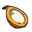 半边椰子 (Coconut Half)
- **饥饿恢复**：-10（烹饪后：-20）
- **额外体力**：无（烹饪后：+10）
- **重量**：5
- **获取**：打破大椰子获得2个半边椰子
- **特效**：移除30点热量
- **位置**：海岸、雨林、台地
- **成就相关**：美食家奖章

####  红脆莓 (Red Crispberry)
- **饥饿恢复**：-5（烹饪后：-10）
- **额外体力**：无（烹饪后：+10）
- **重量**：2.5
- **位置**：海岸、雨林
- **特点**：基础浆果，无负面效果

####  黄脆莓 (Yellow Crispberry)
- **饥饿恢复**：-5（烹饪后：-10）
- **额外体力**：+10（烹饪后：+15）
- **重量**：2.5
- **位置**：海岸、雨林
- **特点**：提供额外体力

####  绿脆莓 (Green Crispberry)
- **饥饿恢复**：-5（烹饪后：-10）
- **额外体力**：无（烹饪后：+10）
- **重量**：2.5
- **中毒**：+10（2秒后，持续4秒）
- **位置**：海岸、雨林
- **特点**：有毒，建议烹饪后食用

#### 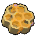 蜂巢蜜 (Honeycomb)
- **饥饿恢复**：-10（烹饪后：-20）
- **额外体力**：+50（烹饪后：+75）
- **重量**：2.5
- **获取**：打破蜂巢获得4个蜂巢蜜
- **位置**：雨林、森蕈
- **成就相关**：美食家奖章

####  火烧莓 (Scorchberry)
- **饥饿恢复**：-10（烹饪后：-20）
- **额外体力**：无（烹饪后：+10）
- **重量**：2.5
- **特效**：增加25点热量
- **位置**：雨林

####  紫荔莓 (Purple Kingberry)
- **饥饿恢复**：-30（烹饪后：-60）
- **额外体力**：+35（烹饪后：+52.5）
- **重量**：5
- **位置**：雨林
- **特点**：高营养价值

#### 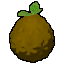 黄荔莓 (Yellow Kingberry)
- **饥饿恢复**：-30（烹饪后：-60）
- **额外体力**：无（烹饪后：+10）
- **重量**：5
- **中毒**：+25
- **位置**：雨林

####  青荔莓 (Green Kingberry)
- **饥饿恢复**：-30（烹饪后：-60）
- **额外体力**：无（烹饪后：+10）
- **重量**：5
- **中毒**：+50
- **位置**：雨林

### 莓蕉类 (Berrynana)

####  黄莓蕉 (Yellow Berrynana)
- **饥饿恢复**：-10（烹饪后：-20）
- **额外体力**：无（烹饪后：+10）
- **重量**：2.5
- **位置**：海岸、雨林

####  粉莓蕉 (Pink Berrynana)
- **饥饿恢复**：-10（烹饪后：-20）
- **额外体力**：无（烹饪后：+10）
- **重量**：2.5
- **特效**：移除30点受伤
- **位置**：海岸、雨林

####  蓝莓蕉 (Blue Berrynana)
- **饥饿恢复**：-10（烹饪后：-20）
- **额外体力**：无（烹饪后：+10）
- **重量**：2.5
- **特效**：移除30点寒冷
- **位置**：海岸、雨林

####  棕莓蕉 (Brown Berrynana)
- **饥饿恢复**：-10（烹饪后：-20）
- **额外体力**：无（烹饪后：+10）
- **重量**：2.5
- **中毒**：+10
- **位置**：海岸、雨林

### 葚莓类 (Clusterberry)

####  黄葚莓 (Yellow Clusterberry)
- **饥饿恢复**：-5（烹饪后：-10）
- **额外体力**：无（烹饪后：+10）
- **重量**：2.5
- **位置**：雪山

####  红葚莓 (Red Clusterberry)
- **饥饿恢复**：-5（烹饪后：-10）
- **额外体力**：无（烹饪后：+10）
- **重量**：2.5
- **位置**：雪山

####  黑葚莓 (Black Clusterberry)
- **饥饿恢复**：-5（烹饪后：-10）
- **额外体力**：无（烹饪后：+10）
- **重量**：2.5
- **中毒**：+10
- **位置**：雪山

#### 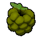 青葚莓 (Green Clusterberry)
- **饥饿恢复**：-5（烹饪后：-10）
- **额外体力**：无（烹饪后：+10）
- **重量**：2.5
- **位置**：雪山

### 雪莓类 (Winterberry)

####  橙雪莓 (Orange Winterberry)
- **饥饿恢复**：-5（烹饪后：-10）
- **额外体力**：无（烹饪后：+10）
- **重量**：2.5
- **位置**：雪山

#### 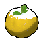 黄雪莓 (Yellow Winterberry)
- **饥饿恢复**：-5（烹饪后：-10）
- **额外体力**：无（烹饪后：+10）
- **重量**：2.5
- **中毒**：+10
- **位置**：雪山
- **成就相关**：美食家奖章

### 刺莓类 (Prickleberry)

####  红刺莓 (Red Prickleberry)
- **饥饿恢复**：-5（烹饪后：-10）
- **额外体力**：+10（烹饪后：+15）
- **重量**：2.5
- **位置**：火山

#### 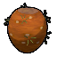 金刺莓 (Gold Prickleberry)
- **饥饿恢复**：-5（烹饪后：-10）
- **额外体力**：无（烹饪后：+10）
- **重量**：2.5
- **特效**：移除30点热量
- **位置**：火山

### 菇莓类 (Shroomberry)

####  红菇莓 (Red Shroomberry)
- **饥饿恢复**：-5（烹饪后：-10）
- **额外体力**：无（烹饪后：+10）
- **重量**：2.5
- **位置**：森蕈

#### 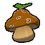 黄菇莓 (Yellow Shroomberry)
- **饥饿恢复**：-5（烹饪后：-10）
- **额外体力**：无（烹饪后：+10）
- **重量**：2.5
- **位置**：森蕈

#### 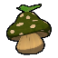 绿菇莓 (Green Shroomberry)
- **饥饿恢复**：-5（烹饪后：-10）
- **额外体力**：无（烹饪后：+10）
- **重量**：2.5
- **位置**：森蕈

#### 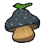 蓝菇莓 (Blue Shroomberry)
- **饥饿恢复**：-5（烹饪后：-10）
- **额外体力**：无（烹饪后：+10）
- **重量**：2.5
- **位置**：森蕈

#### 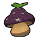 紫菇莓 (Purple Shroomberry)
- **饥饿恢复**：-5（烹饪后：-10）
- **额外体力**：无（烹饪后：+10）
- **重量**：2.5
- **位置**：森蕈

### 其他浆果

####  晚安莓 (Napberry)
- **饥饿恢复**：待补充
- **额外体力**：待补充
- **重量**：2.5
- **特效**：待补充
- **位置**：待补充

### 根茎类

####  药用根茎 (Medicinal Root)
- **饥饿恢复**：-5（烹饪后：-10）
- **额外体力**：无（烹饪后：+10）
- **重量**：2.5
- **特效**：移除25点中毒
- **位置**：雨林、森蕈

#### 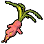 曼德拉草 (Mandrake)
- **饥饿恢复**：-10（烹饪后：-20）
- **额外体力**：无（烹饪后：+10）
- **重量**：2.5
- **中毒**：+20
- **位置**：森蕈
- **特点**：采集时发出尖叫
- **成就相关**：烹饪并吃掉曼德拉草

## 蘑菇类

### 功能蘑菇

蘑菇需要在营火处烹饪才能食用，生吃会中毒。单次探险食用四种无毒蘑菇可获得成就。

#### 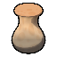 梨鲍菇 (Chubby Shroom)
- **效果**：可食用
- **重量**：2.5
- **位置**：雨林、森蕈、雪山

####  诡异菇 (Weird Shroom)
- **效果**：发光照明
- **重量**：2.5
- **位置**：森蕈、雪山

####  喇叭菇 (Bugle Shroom)
- **效果**：待补充
- **重量**：2.5
- **位置**：待补充

####  馒头菇 (Button Shroom)
- **效果**：待补充
- **重量**：2.5
- **位置**：待补充

####  银针菇 (Cluster Shroom)
- **效果**：待补充
- **重量**：2.5
- **位置**：待补充

**重要提示**：蘑菇一定要好好检查！有些蘑菇不但能要命，甚至能让你拉一裤子进而社会性死亡。

## 包装食品

包装食品可在行李箱中找到。

### 飞机餐 (Airline Food)
- **饥饿恢复**：-40
- **额外体力**：+40
- **重量**：5
- **获取**：行李箱、坠机地点
- **特点**：高营养价值，来自BingBong航空
- **成就相关**：不食用包装食品逃离岛屿

### 能量饮料 (Energy Drink)
- **饥饿恢复**：-20
- **额外体力**：+20
- **重量**：2.5
- **获取**：行李箱

### 运动饮料 (Sports Drink)
- **饥饿恢复**：-10
- **额外体力**：+30
- **重量**：2.5
- **获取**：行李箱

### 童军饼干 (Scout Cookies)
- **饥饿恢复**：-10
- **额外体力**：+10
- **重量**：2.5
- **获取**：行李箱

### 棉花糖 (Marshmallow)
- **饥饿恢复**：-5
- **额外体力**：+5
- **重量**：0
- **特点**：可在营火处烤制
- **获取**：营火附近

### 热狗肠 (Hot Dog)
- **饥饿恢复**：-10（烹饪后：-20）
- **额外体力**：无（烹饪后：+10）
- **重量**：2.5
- **可烹饪**：是
- **成就相关**：5秒内吃掉3根热狗肠

### 煎蛋 (Egg)
- **饥饿恢复**：-5（烹饪后：-10）
- **额外体力**：无（烹饪后：+10）
- **重量**：2.5
- **可烹饪**：是
- **成就相关**：美食家奖章

### 熟鸟肉 (Cooked Bird)
- **饥饿恢复**：-10
- **额外体力**：+10
- **重量**：2.5
- **获取**：待补充

## 神秘食物

### 万灵药 (Cure-All)
- **效果**：清除所有负面状态
- **重量**：2.5
- **稀有度**：神秘
- **成就相关**：玄学奖章

### 潘多拉餐盒 (Pandora's Lunchbox)
- **效果**：随机效果（可能是好的或坏的）
- **重量**：5
- **稀有度**：神秘
- **成就相关**：玄学奖章

## 食物使用策略

### 新手建议

1. **优先级**：
   - 首选：红脆莓、黄脆莓（无负面效果）
   - 避免：绿脆莓、有毒浆果（除非烹饪）
   - 高营养：蜂巢蜜、荔莓类

2. **烹饪收益**：
   - 饥饿恢复翻倍
   - 增加额外体力
   - 移除毒性
   - 累计20次获得烹饪奖章

3. **携带建议**：
   - 轻量食物：莓蕉类、浆果类
   - 应急食物：飞机餐、能量饮料
   - 功能食物：移除热量/寒冷的浆果

### 进阶技巧

1. **成就相关**：
   - **觅食奖章**：单次探险食用5种不同浆果
   - **烹饪奖章**：在营火处做20次饭
   - **博物学家奖章**：只食用自然食物
   - **美食家奖章**：烹饪并食用半边椰子、蜂巢蜜、黄雪莓、煎蛋
   - **蘑菇成就**：单次探险食用四种无毒蘑菇
   - **热狗成就**：5秒内吃掉3根热狗肠
   - **曼德拉草成就**：烹饪并吃掉曼德拉草
   - **无包装食品成就**：逃离岛屿且未食用任何包装食品

2. **环境适应**：
   - 高温区域：携带金刺莓、半边椰子（移除热量）
   - 寒冷区域：携带蓝莓蕉（移除寒冷）
   - 有毒环境：携带药用根茎（移除中毒）

3. **烹饪优化**：
   - 有毒食物优先烹饪
   - 营养价值低的食物烹饪后更有效
   - 在营火处一次性烹饪多个食物

### 食物选择表

| 情况 | 推荐食物 | 原因 |
|------|----------|------|
| 快速恢复 | 荔莓类、飞机餐 | 高饥饿恢复 |
| 增加体力 | 蜂巢蜜、黄脆莓 | 高额外体力 |
| 轻量化 | 棉花糖、莓蕉类 | 重量低 |
| 应对高温 | 金刺莓、半边椰子 | 移除热量 |
| 应对寒冷 | 蓝莓蕉 | 移除寒冷 |
| 治疗受伤 | 粉莓蕉 | 移除受伤 |
| 解毒 | 药用根茎 | 移除中毒 |

## 食物获取

### 自然生成
- **浆果**：在灌木丛和树上
- **蘑菇**：在阴暗潮湿处
- **根茎**：地面挖掘
- **位置**：每次探险随机

### 行李箱
- **包装食品**：飞机餐、饮料、饼干
- **内容随机**：每次探险不同
- **分布**：岛屿各处

### 特殊来源
- **蜂巢**：打破获得4个蜂巢蜜
- **椰子**：打破获得2个半边椰子
- **营火**：棉花糖常在附近

## 重要提示

1. **有毒食物**：绿色浆果通常有毒，烹饪可去毒
2. **烹饪翻倍**：烹饪使饥饿恢复翻倍，强烈推荐
3. **重量管理**：注意食物重量，避免超重影响攀爬
4. **成就规划**：为成就准备特定食物组合
5. **团队分配**：多人模式下合理分配食物资源
6. **蘑菇警告**：野外的植物吃着要小心！万一有毒就得吃不了兜着走！

---

*提示：合理管理食物资源是成功登顶的关键！熟悉各种食物的效果，根据环境和需求选择合适的食物。*

## 相关页面

- [完整道具列表](all-items.md) - 包含所有食物的详细数据
- [装备系统](equipment.md) - 装备道具详解
- [道具系统](README.md) - 道具系统概述
- [烹饪奖章](../achievements/README.md#烹饪奖章) - 烹饪相关成就
- [觅食奖章](../achievements/README.md#觅食奖章) - 浆果收集成就
